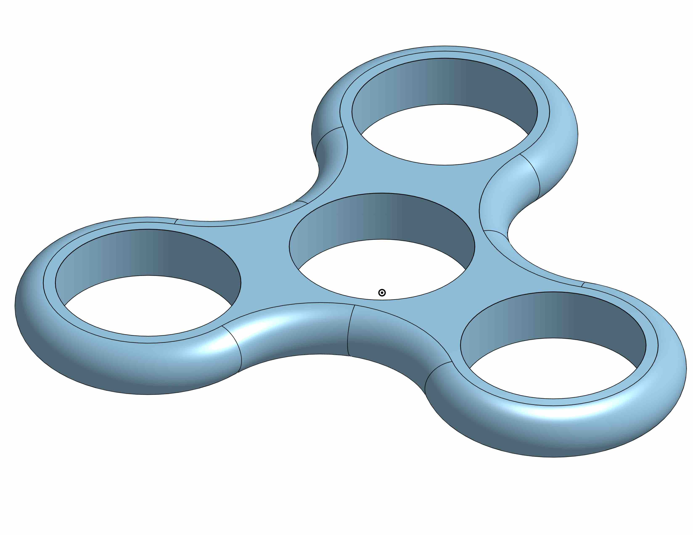

# 3D
A repository of 3D Models and 3D related items modeled by me. 
- [3D](#3d)
- [Programs](#programs)
- [Low Poly Artwork](#low-poly-artwork)
- [Mounts](#mounts)
- [Fidget Spinners](#fidget-spinners)
- [Magnetic Holder](#magnetic-holder)
- [Misc](#misc)
- [Future Models](#future-models)

# Programs
- Blender
- OnShape.io
- Pixelmator

# Low Poly Artwork
- a collection of low poly art and assets

# Mounts

# Fidget Spinners

# Magnetic Holder

# Misc

# Future Models
- Office
- Living Room
- Kitchen
- Bedroom
- Stairway
- Hallway
- Entryway
- Patio
